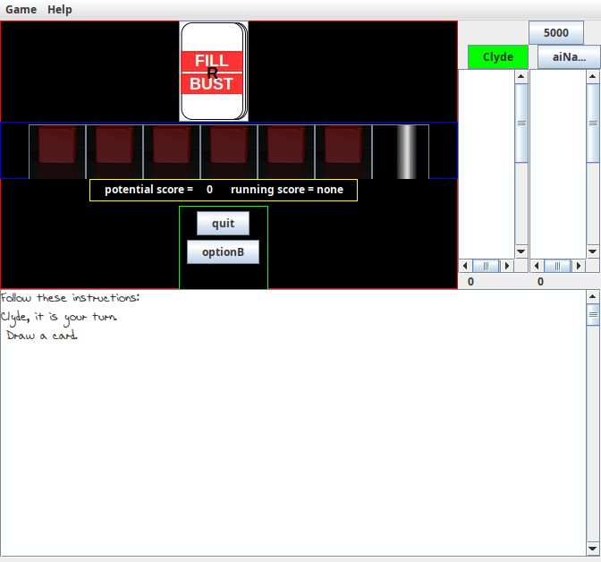
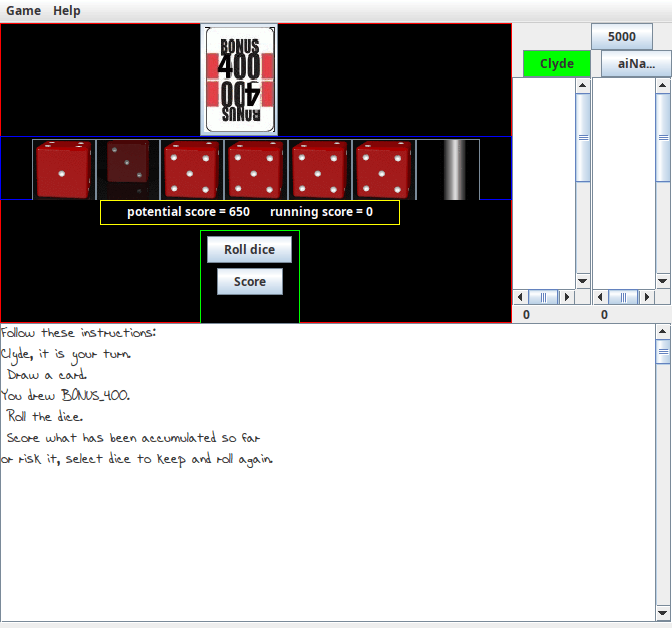

# FillRBust
FillRBust is a card and dice game I have enjoyed with real cards and dice.
As a silly exercize I originally captured the process of playing it in a Python script,
then built a GUI with TKinter.
This repository is a rewrite in Java using Swing and AWT.

## Running the code
From the command line, without any parameters, without a config file, ie
> <prompt\> java -jar <path_to_jar>

The initial playing screen looks like this.

After turning over a card and rolling the dice, one would be presented with a screen like this.

Rules of the game and instructions on how to use the graphical user interface to play it are available from the 'Help' menu. 

Your name probably is not Clyde and you may even want to name your opponent something
other than aiNancy. And you may want to play to 10000 points.
Command line parameters are available to control that,
> <prompt\> java -jar <path_to_jar> -p YourName -p aiOpponent -m 10000

Any number of players, interactive or computer driven, can be declared.
The other way is to generate a config file.
The easiest way to do that is modify one that the code generates.
Use the Game menu to "save rc file". Then modify the appropriate field(s).
The program looks for .fillrbust in the directory from where it is started.
